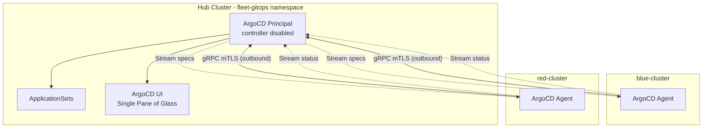

# RHACM GitOps Multi-Tenancy Demo

Fleet-wide GitOps using Red Hat Advanced Cluster Management (RHACM 2.15) and OpenShift GitOps with the **Principal/Agent** architecture. A central ArgoCD Principal on the hub streams Application specs to lightweight Agents on each spoke cluster. Agents reconcile locally and stream status back — no spoke credentials stored on the hub, no inbound firewall rules needed.

## Architecture



### Key Properties

- **Zero-trust** — Spokes initiate all connections; hub stores no spoke credentials
- **Decentralized reconciliation** — Each Agent applies manifests locally
- **Multi-tenant** — AppProjects scope tenant teams to their own applications
- **Self-healing** — Agents auto-revert local drift
- **Scalable** — Adding a cluster = deploy Agent + cert, it auto-joins the fleet

## Branch Strategy

| Branch | Architecture | Status |
|--------|-------------|--------|
| `main` | Push model (centralized fleet-argocd) | Legacy |
| `fleetdev` | **Principal/Agent** (pull-based, mTLS) | Active |

## Prerequisites

- 1 OpenShift hub cluster with RHACM 2.15+ installed
- AWS credentials for spoke cluster provisioning
- OpenShift GitOps operator >= 1.20
- OpenShift pull secret

## Quick Start

```bash
# 1. Login to hub
oc login --token=<token> --server=https://<hub-api>:6443

# 2. Deploy users, groups, and ACM policies
oc create secret generic htpass-secret --from-file=htpasswd=./UsersGroups/htpasswd -n openshift-config
oc apply -k ./UsersGroups
oc apply -k ./AcmPolicies/InstallGitOpsOperator
oc apply -k ./AcmPolicies/FleetArgoCD
oc apply -k ./AcmPolicies/RegisterAllClustersToFleet

# 3. Generate mTLS certificates
bash certs/generate-certs.sh

# 4. Provision spoke clusters (requires AWS credential)
oc apply -f cluster-provisioning/blue-cluster.yaml
oc apply -f cluster-provisioning/red-cluster.yaml

# 5. Deploy ApplicationSets
oc apply -k ./ApplicationSets/fleet

# 6. Deploy Agents on spokes (after clusters are ready)
# See docs/deployment-guide.md Step 10
```

For the full step-by-step guide, see [docs/deployment-guide.md](docs/deployment-guide.md).

## Repository Structure

```
.
├── kustomization.yaml                         # Hub resources (UsersGroups + AcmPolicies)
├── AcmPolicies/
│   ├── InstallGitOpsOperator/                 # Install GitOps operator on hub
│   ├── ArgoCDInstances/                       # Per-tenant ArgoCD instances (optional)
│   ├── RegisterClustersToArgoCDInstances/     # Register per-tenant clusters (optional)
│   ├── FleetArgoCD/                           # fleet-argocd Principal instance
│   └── RegisterAllClustersToFleet/            # GitOpsCluster + Placements + RBAC
├── ApplicationSets/fleet/                     # AppProjects + ApplicationSets
├── PlatformConfig/baseline/                   # Spoke platform config (LimitRange, NetworkPolicy)
├── UsersGroups/                               # OAuth users, groups, HTPasswd
├── cluster-provisioning/                      # Hive ClusterDeployment YAMLs for AWS
├── agents/                                    # ArgoCD Agent CRs + NetworkPolicies
├── certs/                                     # mTLS certificate generation
└── docs/                                      # Detailed documentation
```

## Documentation

| Document | Audience | Description |
|----------|----------|-------------|
| [Architecture](docs/architecture.md) | Stakeholders | High-level architecture, diagrams, design decisions |
| [Control Flow](docs/control-flow.md) | Stakeholders + Engineers | How the Principal manages Agents, lifecycle flows |
| [Deployment Guide](docs/deployment-guide.md) | Engineers | Full step-by-step operational runbook |
| [Cluster Provisioning](docs/cluster-provisioning.md) | Engineers | AWS Hive provisioning guide |
| [Troubleshooting](docs/troubleshooting.md) | Engineers | Common issues and resolutions |

## Access Summary

| User | Group | Sees in fleet-argocd UI |
|------|-------|-------------------------|
| acmsre1 | acm-sre-group | All applications across all clusters |
| bluesre1 | blue-sre-group | `mobileapp-*` applications only |
| redsre1 | red-sre-group | `galaga-*` applications only |

## References

- [Fleet-Scale GitOps Control Flow with RHACM](https://medium.com/@tcij1013/fleet-scale-gitops-control-flow-with-red-hat-advanced-cluster-management-0eca855136c3)
- [RHACM Workshop — Module 01](https://tosin2013.github.io/rhacm-workshop/modules/01-installation.html)
- [RHACM Documentation](https://access.redhat.com/documentation/en-us/red_hat_advanced_cluster_management_for_kubernetes/2.15)
- [OpenShift GitOps Documentation](https://docs.openshift.com/gitops/latest/understanding_openshift_gitops/about-redhat-openshift-gitops.html)
