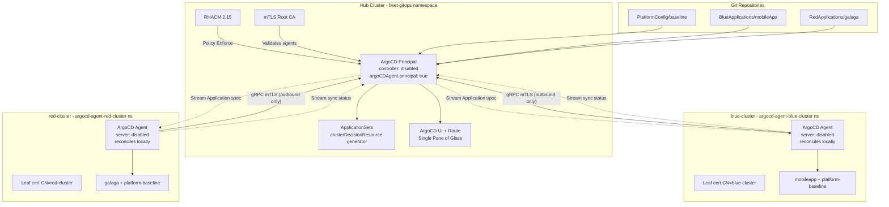
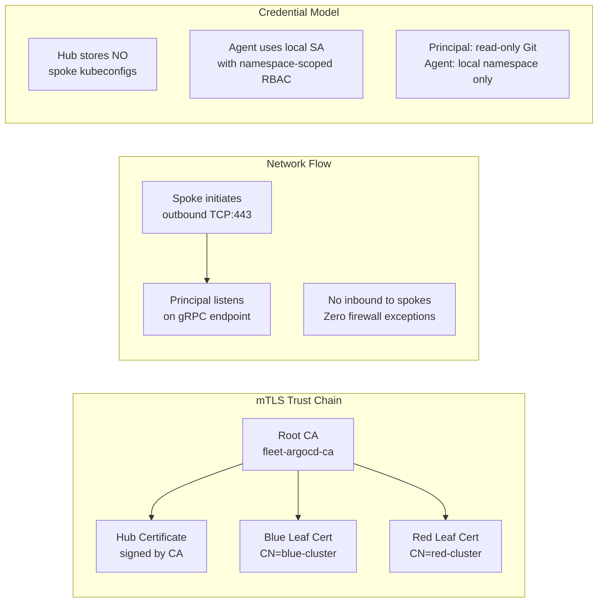
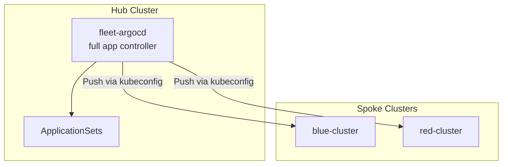
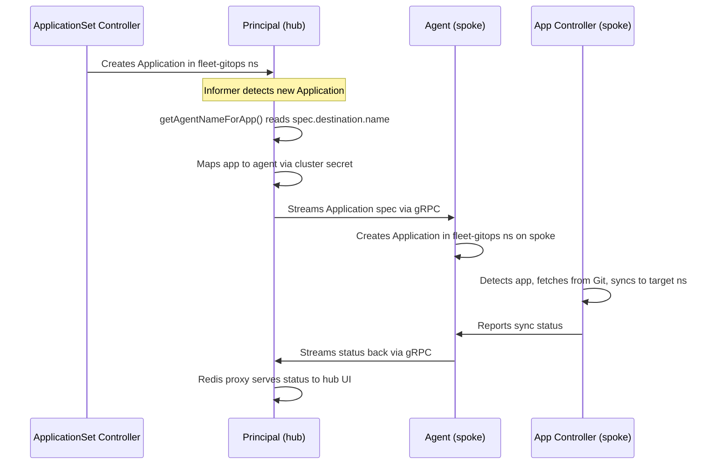

# Fleet-Scale GitOps Architecture

## Overview

This project implements fleet-wide GitOps using Red Hat Advanced Cluster Management (RHACM 2.15) and OpenShift GitOps. It demonstrates two architectural models for managing applications across multiple OpenShift clusters:

- **Phase 1 (Push Model)** — A centralized `fleet-argocd` instance on the hub pushes manifests to downstream clusters (`main` branch)
- **Phase 2 (Principal/Agent Model)** — A decentralized pull architecture where each spoke runs a lightweight ArgoCD Agent (`fleetdev` branch)

---

## Architecture Evolution

| Aspect | Phase 1: Push Model | Phase 2: Principal/Agent |
|--------|---------------------|--------------------------|
| Reconciliation | Hub pushes to spokes via API | Spokes pull from hub via gRPC |
| Credentials | Hub stores spoke kubeconfigs | No hub-side credentials stored |
| Network | Hub needs outbound to spoke APIs | Spoke initiates outbound only |
| Scalability | Linear with cluster count (hub bottleneck) | Offloaded to spokes |
| Security | Hub is credential store (single point of failure) | mTLS zero-trust |
| Failure domain | Hub failure = all spokes lose sync | Spokes continue reconciling independently |

---

## Phase 2: Principal/Agent Architecture (Active)



### Component Responsibilities

| Component | Location | Role |
|-----------|----------|------|
| **ArgoCD Principal** | Hub — `fleet-gitops` namespace | UI, ApplicationSet controller, gRPC endpoint. Application controller is **disabled**. |
| **ArgoCD Agent** | Each spoke — `argocd-agent-<name>` namespace | Local reconciler. Applies manifests using its own ServiceAccount. Streams status to Principal. |
| **ACM Policies** | Hub — `acm-gitops-policy` namespace | Enforce GitOps operator install, Principal CR, cluster registrations |
| **GitOpsCluster + Placements** | Hub — `fleet-gitops` namespace | Cluster discovery and targeting for ApplicationSets |
| **ApplicationSets** | Hub — `fleet-gitops` namespace | Generate per-cluster Application CRs from Placement decisions |
| **AppProjects** | Hub — `fleet-gitops` namespace | Tenant isolation (RBAC boundaries) within Principal UI |
| **mTLS CA** | Hub secret + leaf certs on each spoke | Mutual authentication for Principal-Agent gRPC tunnel |

---

## Why There Is No ArgoCD UI on Spoke Clusters

A common point of confusion: if you log into a spoke cluster and try to access an ArgoCD UI, **you won't find one**. This is intentional.

In the Principal/Agent model, the spoke ArgoCD instance is **headless** — the server component is explicitly disabled:

```yaml
# Agent ArgoCD CR on spoke
spec:
  server:
    enabled: false   # No UI, no route, no API server
```

### What runs where

| Component | Hub (Principal) | Spoke (Agent) |
|-----------|----------------|---------------|
| ArgoCD Server (UI + API) | **Enabled** — single pane of glass | **Disabled** — headless |
| Application Controller | **Disabled** — no local reconciliation | **Enabled** — performs all Git-to-cluster sync |
| ApplicationSet Controller | **Enabled** — generates Application CRs | N/A |
| Agent gRPC component | Principal endpoint (listens) | Agent (initiates outbound connection) |

### How to view application status

- **Primary method**: Log into the **hub ArgoCD UI** — it shows all applications across all clusters with real-time status streamed from agents via the Redis proxy.
- **CLI alternative** (on spoke): `oc get applications.argoproj.io -n fleet-gitops` shows local sync/health status.
- **Hub CLI**: `oc get applications.argoproj.io -n fleet-gitops` on the hub shows the same aggregated view as the UI.

### Why this design?

1. **Security** — No exposed API surface on spoke clusters; the agent only initiates outbound connections
2. **Simplicity** — One dashboard to manage hundreds of clusters, no per-cluster logins
3. **Resource efficiency** — No server/UI pods consuming resources on every spoke
4. **Consistent RBAC** — Tenant access control is enforced once (on the hub) via AppProjects, not replicated per-cluster

---

## Multi-Tenancy Model

Tenant isolation is achieved through ArgoCD AppProjects within the single Principal instance:

```
fleet-argocd Principal (fleet-gitops namespace on hub)
├── AppProject: default    → platform-baseline → all clusters        (acm-sre-group: admin)
├── AppProject: blue-team  → mobile-app         → blueclusterset     (blue-sre-group: admin)
└── AppProject: red-team   → galaga             → redclusterset      (red-sre-group: admin)
```

### Access Control

| User | Group | Sees in fleet-argocd UI |
|------|-------|-------------------------|
| acmsre1 | acm-sre-group | All applications across all clusters |
| bluesre1 | blue-sre-group | `mobileapp-*` applications only (blue-team project) |
| redsre1 | red-sre-group | `galaga-*` applications only (red-team project) |
| acmviewer1 | acm-viewer-group | All applications (read-only) |

---

## Security and Communication Model



### Key Security Properties

1. **Zero-trust networking** — Spokes initiate all connections; no inbound firewall rules needed
2. **No stored credentials** — Hub never stores spoke kubeconfigs
3. **Mutual authentication** — Both Principal and Agent present certificates signed by the shared CA
4. **Least-privilege** — Agent ServiceAccount has only namespace-scoped permissions
5. **Independent failure domains** — If the hub goes down, spokes continue reconciling their last-known state

---

## Phase 1: Push Model (Legacy — `main` branch)

In the push model, a single `fleet-argocd` instance on the hub runs a full application controller that directly pushes manifests to each downstream cluster via stored kubeconfigs:



This model is simpler but creates a hub bottleneck at scale and requires the hub to store credentials for every downstream cluster.

---

## Principal Routing Mechanics

### How Applications Flow from Hub to Spoke

When `destinationBasedMapping=true`, the Principal routes applications based on `spec.destination.name`:



### Key Configuration Requirements

1. **AppProject `destinations[].name` must include agent names** - The Principal uses this field to determine which agents should receive an AppProject. Use `name: "*"` for wildcard matching.

2. **`allowedNamespaces` on Principal** - Controls which namespaces the Principal's informer watches for Application resources. Set via `spec.argoCDAgent.principal.namespace.allowedNamespaces` on the ArgoCD CR.

3. **Destination-based mapping on both sides** - Both Principal (`ARGOCD_PRINCIPAL_DESTINATION_BASED_MAPPING=true`) and Agent (`ARGOCD_AGENT_DESTINATION_BASED_MAPPING=true`, `ARGOCD_AGENT_CREATE_NAMESPACE=true`) must enable this.

4. **Agent `allowedNamespaces`** - The agent needs permission to create apps in the Principal's namespace (`fleet-gitops`) since that's where apps arrive on the spoke. Set via `spec.argoCDAgent.agent.allowedNamespaces` on the agent ArgoCD CR.

5. **Cluster secret `namespaces` field** - On spoke clusters, the in-cluster secret must list all target namespaces the app-controller can deploy to. The operator manages this based on namespace labels.

6. **`ARGOCD_APPLICATION_NAMESPACES` on spoke controllers** - Required when apps live in a different namespace than the ArgoCD instance (e.g., apps in `fleet-gitops`, controller in `argocd-agent-blue-cluster`).

7. **Redis proxy for hub UI** - The hub ArgoCD server must use the Principal's Redis proxy (`fleet-argocd-agent-principal-redisproxy:6379`) to display real sync status from spoke clusters.

### Namespace Topology

```
Hub Cluster:
  fleet-gitops/
    ├── ArgoCD Principal (controller disabled)
    ├── ApplicationSets (generate apps here)
    ├── Applications (routed to agents)
    └── AppProjects (define tenant boundaries)

Spoke Cluster (blue):
  argocd-agent-blue-cluster/
    ├── ArgoCD Agent (connects to Principal)
    ├── Application Controller (syncs apps)
    └── AppProjects (blue-team, default)
  fleet-gitops/
    └── Applications (received from Principal, processed by controller)
  mobileapp/
    └── Deployed resources (synced by controller)
  platform-config/
    └── Deployed resources (synced by controller)
```

---

## Feature Maturity: ArgoCD Agent

The ArgoCD Agent feature is **Generally Available (GA)** as of Red Hat OpenShift GitOps 1.19 (March 2026). It was previously available as Technology Preview in GitOps 1.17 and 1.18.

### Version Compatibility

| GitOps Version | Agent Status | Supported OCP Versions |
|----------------|-------------|------------------------|
| 1.17 | Tech Preview | 4.12-4.19 |
| 1.18 | Tech Preview | 4.14, 4.16-4.20 |
| 1.19 | **GA** | 4.14, 4.16-4.21 |
| 1.20 | **GA** | 4.14, 4.16-4.21 |

**OCP 4.22 Note:** As of June 2026, the OpenShift GitOps operator installs and functions on OCP 4.22 via OLM but is not yet officially listed in the 1.20 support matrix. A future GitOps release will add 4.22 to the compatibility matrix.

### GA Capabilities

- Agent-based pull architecture (managed and autonomous modes)
- mTLS-secured gRPC communication between Principal and Agents
- FIPS-validated cryptographic modules
- Agent installation via ArgoCD custom resource (GitOps 1.20+)
- Agent installation via Helm charts
- Centralized observability (single pane of glass) on the hub cluster

### Known Limitations (as of GitOps 1.20)

- No high availability for the Principal component
- Partial ApplicationSet support
- Limited App-of-Apps pattern support in managed mode
- No pod log streaming or terminal access from the control plane
- Advanced RBAC and multi-tenancy under development
- Limited "Applications in any namespace" on workload clusters

### Licensing

ArgoCD Agent requires an **OpenShift Platform Plus** subscription for each agent (spoke) cluster.

---

## References

- [OpenShift GitOps 1.19 Release Notes (GA Announcement)](https://docs.redhat.com/en/documentation/red_hat_openshift_gitops/1.19/html/release_notes/gitops-release-notes)
- [ArgoCD Agent Architecture Overview](https://docs.redhat.com/en/documentation/red_hat_openshift_gitops/1.20/html/argo_cd_agent_architecture/argocd-agent-architecture)
- [ArgoCD Agent Installation Guide](https://docs.redhat.com/en/documentation/red_hat_openshift_gitops/1.20/html-single/argo_cd_agent_installation/)
- [OCP 4.22 GitOps Integration](https://docs.redhat.com/en/documentation/openshift_container_platform/4.22/html-single/gitops/index)
- [Fleet-Scale GitOps Control Flow with RHACM](https://medium.com/@tcij1013/fleet-scale-gitops-control-flow-with-red-hat-advanced-cluster-management-0eca855136c3)
- [OpenShift GitOps ArgoCD Agent (Community Blog)](https://blog.stderr.at/gitopscollection/2026-01-14-argocd-agent/)
- [Supercharge Your GitOps with ArgoCD Agent — DevConf.IN 2026](https://www.youtube.com/watch?v=jUmW8X6fv6w)
- [RHACM Documentation](https://access.redhat.com/documentation/en-us/red_hat_advanced_cluster_management_for_kubernetes/2.15)
- [OpenShift GitOps Documentation](https://docs.openshift.com/gitops/latest/understanding_openshift_gitops/about-redhat-openshift-gitops.html)
- [RHACM Workshop — Module 01](https://tosin2013.github.io/rhacm-workshop/modules/01-installation.html)
