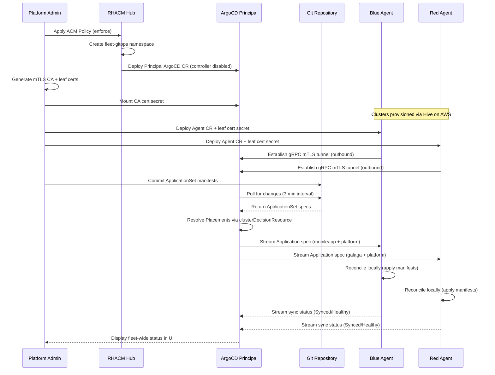

# Control Flow: How the Principal Manages Downstream ArgoCD Agents

## Overview

The deployment uses **Hub-Authoritative Managed Mode**. The Principal is the single source of truth for Application `.spec` fields — Agents merely execute locally and report status. Any local drift on a spoke is automatically reverted by the Agent.

---

## Control Flow Sequence



---

## Step-by-Step Control Flow

### 1. Infrastructure Bootstrap

1. ACM Policy enforces the OpenShift GitOps operator is installed on the hub
2. ACM Policy creates the `fleet-gitops` namespace and deploys the ArgoCD CR in **Principal mode** (application controller disabled, `argoCDAgent.principal.enabled: true`)
3. The Principal pod starts and loads mTLS certificates from Kubernetes secrets
4. The Principal opens a gRPC listener secured with the root CA

### 2. Agent Registration

5. On each spoke cluster, the ArgoCD Agent CR is deployed with a leaf certificate (CN matches the cluster name)
6. The Agent establishes an **outbound** gRPC connection to the Principal's route
7. The Principal validates the Agent's certificate against the shared CA
8. The Principal extracts the Agent's identity from the certificate CN field using the regex `CN=([^,]+)`

### 3. Cluster Discovery (ACM Integration)

9. ACM Policy creates `GitOpsCluster` + `Placement` resources in `fleet-gitops`
10. ACM generates PlacementDecisions based on ManagedClusterSet membership and label selectors
11. For each PlacementDecision, ACM creates a cluster Secret that ApplicationSets can consume

### 4. Application Generation

12. ApplicationSets use the `clusterDecisionResource` generator to watch PlacementDecisions
13. When a new cluster appears in a PlacementDecision, the ApplicationSet generates a new Application CR
14. The Application CR targets a specific cluster (via `{{server}}` template variable)

### 5. Spec Distribution (Principal to Agent)

15. The Principal detects the new Application CR
16. The Principal matches the Application's target cluster to a connected Agent (via the cluster name)
17. The Principal streams the Application spec to the matching Agent over the gRPC tunnel

### 6. Local Reconciliation (Agent)

18. The Agent receives the Application spec
19. The Agent clones the Git repository specified in the Application source
20. The Agent renders the manifests (Kustomize, Helm, or plain YAML)
21. The Agent applies the manifests to its local cluster using its ServiceAccount
22. The Agent monitors the applied resources for drift

### 7. Status Reporting (Agent to Principal)

23. The Agent streams real-time sync status back to the Principal (Synced, OutOfSync, Degraded, Healthy, etc.)
24. The Principal aggregates status from all connected Agents
25. The Principal UI displays fleet-wide status — accessible to platform admins

### 8. Self-Healing

26. If resources drift from desired state on a spoke, the Agent detects the difference
27. The Agent reverts the drift automatically (selfHeal: true)
28. Updated status is streamed to the Principal

---

## How a New Cluster Joins the Fleet

Adding a new cluster to the fleet requires:

1. **Provision the cluster** (via Hive, ROSA, or manual import)
2. **Label it** into a ManagedClusterSet: `oc label managedcluster <name> cluster.open-cluster-management.io/clusterset=<set>`
3. **Generate a leaf certificate** with `CN=<cluster-name>` signed by the fleet CA
4. **Deploy the ArgoCD Agent** on the spoke with the leaf cert mounted
5. The Agent connects to the Principal automatically
6. The Placement detects the new cluster, PlacementDecision updates
7. ApplicationSets generate new Application CRs for the cluster
8. The Principal streams specs to the new Agent
9. The Agent reconciles locally — the cluster is now part of the fleet

No hub restart, no credential rotation, no firewall changes required.

---

## Comparison: Push Model vs Principal/Agent

| Step | Push Model | Principal/Agent |
|------|-----------|-----------------|
| Cluster registration | ACM generates kubeconfig secret on hub | ACM generates PlacementDecision; Agent connects outbound |
| Application delivery | Hub app controller pushes via API | Principal streams spec over gRPC; Agent applies locally |
| Status collection | Hub polls spoke API for resource status | Agent streams status in real-time |
| Drift correction | Hub detects drift via poll, re-pushes | Agent detects drift locally, reverts immediately |
| Failure mode | Hub down = no sync anywhere | Hub down = Agents continue last-known state |
| New cluster onboarding | Label + wait for ApplicationSet | Label + deploy Agent + cert → auto-joins |
| Credential exposure | Hub stores N kubeconfigs | Hub stores zero spoke credentials |

---

## ApplicationSet Generators

The project uses the ACM-integrated `clusterDecisionResource` generator:

```yaml
generators:
  - clusterDecisionResource:
      configMapRef: acm-placement
      labelSelector:
        matchLabels:
          cluster.open-cluster-management.io/placement: fleet-placement
      requeueAfterSeconds: 180
```

This generator watches PlacementDecision resources created by ACM. When clusters are added to or removed from a ManagedClusterSet, the Placement updates, PlacementDecisions change, and ApplicationSets automatically create or prune Application CRs.

### Placement Topology

| Placement | Scope | Used By |
|-----------|-------|---------|
| `fleet-placement` | All OpenShift clusters (global ManagedClusterSet) | `fleet-platform-appset` (platform baseline) |
| `blue-placement` | `blueclusterset` only | `mobile-application-set` |
| `red-placement` | `redclusterset` only | `galaga-application-set` |
